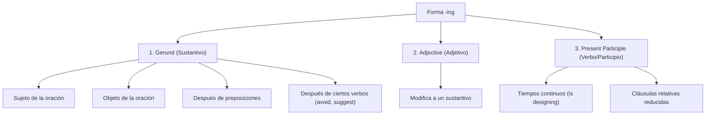

# Guía de Estudio y Fundamentos - Inglés II (UTN FRA)

Esta guía recopila todo el conocimiento lingüístico, técnico e histórico de las **primeras 3 unidades** de tu booklet. Está estructurada no para que memorices reglas sueltas, sino para que entiendas **el porqué** de cada estructura, su aplicación directa en la informática y cómo se comunican las ideas en nuestra disciplina.

---

## 🗺️ Mapa de Contenidos (Units 1 - 3)

1. [**Unit 1: Programming Design & Computer Languages**](#-unit-1-programming-design--computer-languages)
   * Vocabulario de programación y lenguajes (lenguajes de bajo/alto nivel vs. de marcado).
   * Gramática: *The Infinitive* (con y sin "to"), *The -ing form* (gerundio, participio y adjetivo), *Modal Verbs*, y *Relative Clauses*.
   * Función comunicativa: Descripción de funciones y características.
2. [**Unit 2: Gaming & AI Future**](#-unit-2-gaming--ai-future)
   * Vocabulario de géneros de videojuegos y modismos contextuales.
   * Gramática: *Present Perfect Continuous* y *Future Perfect*.
3. [**Unit 3: A Little Bit of History (UTN FRA & UON)**](#-unit-3-a-little-bit-of-history-utn-fra--uon)
   * Contexto histórico y origen de nuestra universidad.
   * Gramática: *The Passive Voice* (Present, Past & Future) y *Past Perfect*.

---

## 💻 Unit 1: Programming Design & Computer Languages

> [!NOTE]
> **El Concepto Clave**: Un programador no solo escribe código; se comunica con máquinas y humanos. Entender la diferencia entre lenguajes estructurados, compilados e interpretados, y diferenciar un lenguaje de programación de uno de marcado, es el cimiento de la arquitectura de software.

### 📝 Vocabulario Esencial (Procesos y Lenguajes)

| Término | Definición Técnica | Función / Rol |
| :--- | :--- | :--- |
| **Flowchart** | Diagrama que representa los pasos lógicos sucesivos de un programa. | Planificación visual y lógica. |
| **Source Code** | Instrucciones de programa escritas en un lenguaje de programación específico. | Legible por el humano. |
| **Compiler** | Software especial que convierte todo el código fuente en código objeto (código máquina) de una sola vez. | Generación de ejecutables rápidos. |
| **Interpreter** | Software que traduce y ejecuta el código fuente línea por línea mientras el programa corre. | Flexibilidad, depuración dinámica. |
| **Machine Code** | Instrucciones básicas entendidas directamente por la CPU; consiste en 1s y 0s (código binario). | Lenguaje de nivel físico (hardware). |
| **Debugging** | Técnicas de detección y corrección de errores (bugs) en el código. | Mantenimiento y calidad de software. |
| **Markup Language** | Lenguaje (como HTML, XML) que usa etiquetas para formatear y enlazar archivos de texto, no para programar lógica. | Presentación y estructuración de datos. |

#### 🔍 Tipos de Lenguajes de Programación y Marcado:
* **Low-level (Bajo nivel)**: Más cercanos al hardware, complejos y restringidos a máquinas específicas (ej. *Machine Code* y *Assembly* que usa mnemónicos como `ADD`, `SUB`, `MPY`).
* **High-level (Alto nivel)**: Más cercanos al lenguaje humano (inglés), independientes del hardware.
  * **FORTRAN (1954)**: Primer lenguaje de alto nivel (IBM), para aplicaciones científicas y de ingeniería.
  * **COBOL (1959)**: Ampliamente utilizado en negocios y procesamiento de datos comerciales (`ADD VAT to NET-PRICE`).
  * **BASIC (1960s) / Visual BASIC**: Creado para enseñar programación. Visual BASIC introdujo el diseño de componentes visuales (botones, ventanas) en Windows.
  * **PASCAL (1971)**: Diseñado en universidades para enseñar los fundamentos de la programación estructurada.
  * **C (1980s) & C++**: C es para software de sistema y gráficos. C++ introduce la *Programación Orientada a Objetos (OOP)*, permitiendo encapsular datos y funciones en objetos reutilizables.
  * **Java (1995)**: Diseñado por Sun Microsystems para correr en la Web mediante *applets* interactivos.
  * **Python (1991)**: Creado por Guido van Rossum (inspirado por Monty Python). Destaca por su legibilidad ("pseudocódigo ejecutable") y bibliotecas de interfaz gráfica (Tkinter, PyQt, Kivy).
* **Markup Languages (Lenguajes de Marcado)**:
  * **HTML**: Describe cómo se mostrará la información en páginas web visuales usando etiquetas predefinidas.
  * **XML**: (*EXtensible Markup Language*). Permite definir nuestras propias etiquetas personalizadas, no está limitado como HTML.
  * **VoiceXML**: Permite hacer accesible el contenido web mediante la voz y el teléfono (el "HTML de la voz"), interactuando con un navegador de voz.

---

### ⚙️ Gramática y Sintaxis de la Unidad 1

#### 1. The Infinitive (El Infinitivo)
El infinitivo se divide en dos formas fundamentales. Su uso depende de la estructura sintáctica:

* **Infinitive with "to"**:
  1. **Para expresar propósito (Purpose)**: Indica el *para qué* hacemos algo.
     * *Ejemplo*: "We use symbolic languages **to communicate** instructions." (Usamos lenguajes simbólicos **para comunicar** instrucciones).
     * *¡Ojo!* Nunca uses `for + infinitivo con to` o `for + verbo base`. Decir "~~for to communicate~~" o "~~for communicate~~" es un error conceptual grave. Usá **to + verb** o **in order to + verb**.
  2. **Después de adjetivos**:
     * *Ejemplo*: "Machine code is too difficult **to write**." / "BASIC was easy **to learn**."
  3. **Después de ciertos verbos**: `afford, plan, agree, expect, hope, learn, try, decide, manage, refuse`.
     * *Ejemplo*: "A lot of companies are trying **to develop** voice applications."
  4. **Después del objeto de ciertos verbos**: `allow, enable, encourage, tell, ask, want, warn`.
     * *Ejemplo*: "HTML allows us **to describe** how information is displayed." (Objeto: *us*).

* **Bare Infinitive (Infinitivo sin "to")**:
  1. **Después de verbos modales**: `can, could, may, might, will, would, must, should`.
     * *Ejemplo*: "Computers can't **understand** spoken English." / "High-level languages must **be** translated."
  2. **Después del objeto con los verbos "make" y "let"**:
     * *Ejemplo*: "Programs make computers **perform** specific tasks." (Hacen que las computadoras ejecuten). / "Let me **explain**."

---

#### 2. The -ing form (El sufijo -ing)
En inglés técnico, la terminación `-ing` **NO siempre es un gerundio en el sentido del español (ando/endo)**. Cumple tres funciones sintácticas cruciales:



1. **Gerund (Gerundio)**: Funciona exactamente como un **sustantivo** (el acto de hacer algo).
   * **Como Sujeto**: "**Programming** is the process of writing code." (La programación / El programar es...).
   * **Como Objeto**: "Rendering includes **lighting** and **shading**."
   * **Después de preposiciones**: "A lot of time is saved by **testing** a car design." (Se ahorra mucho tiempo **probando**...).
   * **Después de ciertos verbos**: `avoid, finish, suggest, involve, enjoy, keep`.
     * *Ejemplo*: "I suggest **using** PowerPoint."
2. **Adjective (Adjetivo)**: Modifica directamente a un sustantivo.
   * *Ejemplo*: "They use special applets to create **amazing** fractals." (Fractales **sorprendentes**).
3. **Present Participle (Participio Presente)**: Se usa en tiempos verbales continuos o cláusulas relativas reducidas.
   * *Ejemplo (Tiempo Continuo)*: "She is **designing** a logo." (Ella está diseñando...).
   * *Ejemplo (Cláusula Relativa Reducida)*: "The Internet is a network **linking** other networks." (Equivale a: *a network which links...*).

---

#### 3. Modal Verbs (Verbos Modales)
Los modales alteran el significado del verbo principal (bare infinitive). Son pilares de la documentación técnica y las normativas de seguridad:

* **Must / Have to** (Obligación):
  * **Must**: Obligación interna o fuerte necesidad impuesta por el hablante.
    * *Ejemplo*: "You **must** do it in the dining room." (Es una regla absoluta de la empresa).
  * **Have to**: Obligación externa (leyes, reglamentos o la realidad técnica).
    * *Ejemplo*: "You **have to** change the password Natasha gives you."
* **Mustn't** (Prohibición estricta):
  * *Ejemplo*: "You **mustn't** eat or put drinks near the computers." (¡Prohibido!).
* **Don't have to / Doesn't have to** (Falta de obligación/necesidad):
  * *¡Cuidado!* No significa prohibición, significa que **no es necesario** hacerlo (opcional).
  * *Ejemplo*: "You **don't have to** spend time cleaning your stuff." (No tenés obligación de hacerlo, otro lo hace por vos).
* **Should** (Consejo o recomendación):
  * *Ejemplo*: "You **should** change passwords immediately."
* **Can / Could / Be able to** (Capacidad / Habilidad):
  * *Ejemplo (Presente)*: "You **can** take short breaks."
  * *Ejemplo (Pasado)*: "I **could** not program when I was a child."
  * *Ejemplo (Futuro)*: "You **will be able to** program in nearly every language."
* **Might / May** (Posibilidad):
  * *Ejemplo*: "You **might** find it difficult." (Es posible que lo encuentres difícil).

---

#### 4. Relative Clauses (Cláusulas Relativas)
Sirven para enlazar ideas y evitar la repetición innecesaria. Son esenciales en las definiciones de componentes de hardware o software.

* **Pronombres Relativos**:
  * **Who / That**: Para personas. (*"She is the person who sets the passwords."*)
  * **Which / That**: Para cosas/conceptos. (*"A bus is a central cable which links computers."*)
  * **Where**: Para lugares físicos o lógicos. (*"The room where all our staff eat."*)

* **Defining vs. Non-defining**:
  * **Defining (Especificativas)**: Brindan información **esencial** para identificar al sujeto. Sin esta cláusula, la oración pierde sentido. **NO llevan comas** y permiten usar "that".
    * *Ejemplo*: "Here are some bugs **that the developer has identified**."
  * **Non-defining (Explicativas)**: Brindan información **extra o accesoria**. El sujeto ya está completamente identificado. **SIEMPRE van entre comas** y **NO se puede usar "that"** (se debe usar *who* o *which*).
    * *Ejemplo*: "Clare, **who I work with**, is in charge of the project."

---

### 🛠️ Función Comunicativa: Describir Funciones y Características
Para describir cómo funciona un componente de hardware o software, tenés cuatro patrones fundamentales. ¡Manejarlos te da nivel profesional!

1. **Preposición + Gerundio (`for + -ing`)**: Describe el propósito general o diseño del objeto.
   * *Ejemplo*: "This is a device **for controlling** the cursor."
2. **Infinitive to express purpose (`used to + infinitive`)**: Describe el uso directo.
   * *Ejemplo*: "It is **used to control** the screen elements."
3. **Relative clause (`which/that is used to...`)**:
   * *Ejemplo*: "This is an input device **which is used to select** items."
4. **Modal + Bare Infinitive (`can + verb`)**: Describe lo que el usuario puede lograr.
   * *Ejemplo*: "You **can connect** it to the computer wirelessly."

---

## 🎮 Unit 2: Gaming & AI Future

> [!NOTE]
> **El Concepto Clave**: La industria del gaming empuja los límites de la computación. Estudiar los géneros y predecir el futuro tecnológico requiere dominar los tiempos perfectos: conectar el pasado con el presente (*Present Perfect Continuous*) y visualizar hitos completados en un punto del futuro (*Future Perfect*).

### 🕹️ Géneros de Videojuegos y Vocabulario

* **FPS (First-Person Shooters) / Action**: Dominan el mercado competitivo (*Call of Duty, Valorant, Apex Legends*). Juegos de mundo abierto como *Red Dead Redemption 2* o *GTA VI* empujan el fotorrealismo y la narrativa.
* **RPGs (Role-Playing Games)**: Pilares de inmersión y toma de decisiones (*Elden Ring, Baldur's Gate 3, Cyberpunk 2077*).
  * **Live-service RPGs**: Juegos como *Genshin Impact* que ofrecen worlds expansivos y actualizaciones de contenido constantes.
  * **MMORPGs**: Rol multijugador masivo en línea (*Final Fantasy XIV, World of Warcraft*).
* **Adventure & Puzzle**: Resurgimiento impulsado por desarrolladores indie y mecánicas innovadoras (*Zelda: Tears of the Kingdom, Portal, Among Us*).
* **Sports & Racing**: Simulaciones hiperrealistas de deportes y conducción (*EA Sports FC, Forza Horizon, Gran Turismo*).
* **Simulation**: Simuladores de vida (*The Sims 4, Stardew Valley*), simuladores de vuelo (*Microsoft Flight Simulator*) y de construcción de ciudades (*Cities: Skylines*).
* **Strategy**: Estrategia táctica por turnos (*Civilization VI, XCOM 2*) y estrategia en tiempo real (RTS, como *Age of Empires IV*).
* **Fighting**: Nueva era competitiva con deportes electrónicos (*Street Fighter 6, Tekken 8*).

#### 🗣️ Expresiones Idiomáticas y Conectores de la Unidad
* **Yelling**: Gritar / Vociferar (asociado a la frustración de usuarios en llamadas de soporte).
* **Pacify (someone)**: Calmar o apaciguar a alguien que está enojado.
* **In the near future**: Muy pronto, a la brevedad.
* **As a matter of fact**: De hecho / En realidad (usado para dar énfasis o aportar detalles precisos).
* **Empathetic**: Empático (capaz de ponerse en el lugar del otro y compartir sus sentimientos).

---

### ⚙️ Gramática de la Unidad 2

#### 1. Present Perfect Continuous (Presente Perfecto Continuo)
Se utiliza para enfatizar el **desarrollo, duración o repetición** de una acción que comenzó en el pasado y continúa hasta el presente, o cuyos efectos son inmediatamente visibles.

* **Estructura**:
  $$\text{Subject} + \text{have / has} + \text{been} + \text{verb-ing}$$

* **Ejemplos**:
  * *Afirmativo*: "Adventure and Puzzle games **have been experiencing** a resurgence."
  * *Negativo*: "The party game genre **hasn't been evolving** as fast as expected."
  * *Interrogativo*: "**Have** FPS games **been dominating** the market recently?"

* **Diferencia crucial con el Present Perfect Simple**:
  * **Present Perfect Simple**: Se enfoca en el **resultado** de la acción (si se completó o no, o cuántas veces).
    * *Ejemplo*: "They **have interviewed** five candidates today." (Acción cerrada o cuantificada).
  * **Present Perfect Continuous**: Se enfoca en el **proceso o la duración** (la acción sigue activa o acaba de detenerse y dejó huellas).
    * *Ejemplo*: "They **have been interviewing** candidates since 9 o'clock." (Énfasis en el tiempo transcurrido).

---

#### 2. Future Perfect (Futuro Perfecto)
Se utiliza para situarnos en un punto del futuro y mirar hacia atrás en el tiempo, identificando acciones que **ya habrán sido completadas** antes de ese momento o de que ocurra otro evento.

* **Estructura**:
  $$\text{Subject} + \text{will} + \text{have} + \text{past participle (3ra columna / -ed)}$$

* **Ejemplos**:
  * *Afirmativo*: "By 2035, developers **will have fully integrated** artificial intelligence." (Significa que la integración de la IA ocurrirá *antes* de que llegue el año 2035).
  * *Negativo*: "We **won't have finished** the report by Friday."
  * *Interrogativo*: "**Will** you **have unlocked** all abilities by the time you reach level 50?"

* **Marcadores temporales comunes**: `by tomorrow` (para mañana), `by the time...` (para el momento en que...), `in ten years' time` (dentro de diez años).

---

## 🏛️ Unit 3: A Little Bit of History

> [!NOTE]
> **El Concepto Clave**: La historia de la UTN FRA refleja la transformación industrial y social de la Argentina. Para narrar hitos históricos y describir procesos técnicos u organizacionales donde no importa *quién* hizo la acción sino *el hecho en sí*, recurrimos a la **Voz Pasiva** y al **Pasado Perfecto**.

### 📜 Historia de la UTN FRA (Conceptos Clave del Texto)

* **Creación de la Facultad Regional de Avellaneda (FRA)**: Creada el **31 de marzo de 1955** por la Resolución 382/55 de la Comisión Nacional de Aprendizaje y Orientación Profesional, bajo la jurisdicción de la **Universidad Obrera Nacional (UON)**.
* **Contexto Político y Social**: Fue parte de los objetivos del *Segundo Plan Quinquenal* del gobierno de Juan Domingo Perón. Se buscaba capacitar a los graduados de escuelas industriales con conocimientos avanzados para liderar la industria emergente nacional bajo el modelo de *sustitución de importaciones*.
* **Creación de la UON**: Establecida previamente el **19 de agosto de 1948** por la Ley 13.329, como una respuesta directa para proveer ingenieros y profesionales de clase trabajadora. Docentes de la histórica Escuela Industrial *Otto Krause* se unieron para buscar esta solución educativa de alto nivel.
* **La Dictadura de 1955 y la Crisis**: Tras el golpe de Estado de 1955, la UON fue fuertemente perseguida y estuvo al borde de la disolución debido a su estrecha asociación con el proyecto político anterior.
* **El Nacimiento de la UTN**: Para resolver la crisis institucional y asegurar su supervivencia, el **14 de octubre de 1959** se promulgó la **Ley 14.855**, otorgándole a la universidad un marco legal autónomo e independiente, renombrándola como **Universidad Tecnológica Nacional (UTN)**.
* **Crecimiento Físico**:
  * **Sede Central (Plaza Alsina)**: Inició clases el 5 de mayo de 1955, pero el rápido incremento en la matrícula hizo que el edificio resultara insuficiente.
  * **Campus Villa Domínico**: Construido en la intersección de las avenidas Mitre y Ramón Franco, en terrenos cedidos a la universidad.

---

### ⚙️ Gramática de la Unidad 3

#### 1. The Passive Voice (La Voz Pasiva)
La voz pasiva se utiliza cuando el foco de la oración está en la **acción o en el objeto que recibe la acción**, en lugar del sujeto que la realiza. Es el estándar de oro en manuales técnicos y reportes académicos.

* **Regla de oro**: El objeto de la oración activa se convierte en el sujeto de la oración pasiva. Se utiliza el verbo **TO BE** (conjugado en el tiempo correcto) + el **PAST PARTICIPLE** del verbo principal.

```
Activa:   Subject  +  Verb   +  Object
            [Two students]   [created]   [Google]

Pasiva:   Subject  +  TO BE  +  Past Participle  +  by  +  Agent
             [Google]       [was]       [created]       [by] [two students]
```

##### 📊 Cuadro de Conjugación Pasiva por Tiempos:

| Tiempo Verbal | Estructura Pasiva | Ejemplo Activo | Ejemplo Pasivo |
| :--- | :--- | :--- | :--- |
| **Present Simple** | `am / is / are + Participle` | "They understand Spanish." | "Spanish **is understood** by them." |
| **Past Simple** | `was / were + Participle` | "Two students created Google." | "Google **was created** by two students." |
| **Future Simple** | `will be + Participle` | "They will send astronauts." | "Astronauts **will be sent** to the moon." |

* **Uso del "by"**: Solo mencionamos al agente ejecutor (con `by...`) si aporta información relevante o indispensable. Si es obvio o desconocido, se omite.
  * *Ejemplo*: "These cars are produced in Italy." (No hace falta decir *by workers*).

---

#### 2. Past Perfect Simple (Pasado Perfecto)
Se utiliza para establecer una **secuencia temporal clara en el pasado**. Específicamente, sirve para hablar de una acción que ocurrió **antes** de otra acción en el pasado (un "pasado del pasado").

* **Estructura**:
  $$\text{Subject} + \text{had} + \text{past participle}$$

* **Ejemplo del texto**:
  "On August 19, 1948, the National Workers’ University **had been created**... [antes de que en 1955 se fundara la FRA]."
  
  * *Secuencia lógica*:
    1. Acción 1 (Pasado Perfecto): Se crea la UON (1948) $\rightarrow$ *The UON **had been created**.*
    2. Acción 2 (Pasado Simple): Se crea la FRA (1955) $\rightarrow$ *The FRA **was created**.*

* **Comparación visual de secuencia**:
```
  PASADO DEL PASADO                      PASADO                           PRESENTE
=====================================================================================
  [1948: UON created] ------------> [1955: FRA created] ----------------> [Hoy]
   (Past Perfect: HAD BEEN)           (Past Simple: WAS)
```

---

## 📋 Lista de Verificación para Autoevaluación

- [ ] ¿Sé diferenciar un infinitivo de propósito (`to + verb`) de la estructura errónea `for + verb`?
- [ ] ¿Puedo identificar si un `-ing` está funcionando como Sustantivo (Gerundio), Adjetivo, o Verbo Continuo?
- [ ] ¿Comprendo la diferencia semántica entre `must` (obligación directa), `have to` (obligación externa) y `don't have to` (falta de necesidad)?
- [ ] ¿Tengo claro cuándo usar comas en una Relative Clause (Non-defining) y cuándo no (Defining)?
- [ ] ¿Sé estructurar el Present Perfect Continuous para enfatizar la duración de un proceso técnico?
- [ ] ¿Sé secuenciar dos eventos futuros usando el Future Perfect (`will have + participle`)?
- [ ] ¿Sé transformar una oración técnica de voz activa a pasiva en presente, pasado y futuro?
- [ ] ¿Puedo usar el Past Perfect (`had + participle`) para relatar hechos históricos en orden cronológico correcto?
