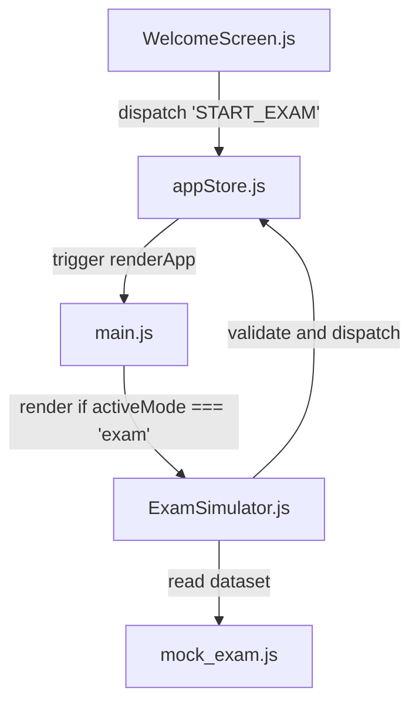

# SDD Proposal: Exam Simulator Implementation

## 1. Architectural Changes
We will implement the Exam Simulator using a clean, modular structure that matches the current architecture of `ingles-web`:

### A. Data Schema (`src/data/units/mock_exam.js`)
We will export `mockExamData` containing the exact parsed fields from the DOCX file, including comprehensive metadata, questions, listening transcript, correct answers, and "El Lado Humano" (Root Cause / Team Interaction explanations) context.

### B. UI Component (`src/components/ExamSimulator.js`)
We will create `renderExamSimulator(containerElement, store)` which handles:
- **Navigation Panel**: Step-by-step progress indicator (Steps 1 to 6).
- **Responsive Layout**: Minimal vertical height, ensuring all content fits comfortably without endless scrolls.
- **Dynamic Inputs**: `<select>` dropdowns inside paragraph text for paragraph filling, and auto-verifying `<input type="text">` fields for passive re-writing.
- **Listening Player Emulator**: A simulated audio playback interface with play/pause icons, current time tracking, and interactive transcript completion.
- **Writing AI-Checker (Vanilla JS)**: Reactive `<textarea>` that performs real-time checks using regex:
  - Infinitive of purpose: `\b(to \w+)\b`
  - Relative clause: `\b(which|who|that)\b`
  - Modal verb: `\b(can|could|must|should|might|may|have to)\b`

### C. State Extensions (`src/store/appStore.js`)
- `examStepIndex`: Track the active step in the exam (1 to 6).
- `examAnswers`: Track the user's answers for each section.
- `examSubmitted`: Boolean indicating if the test was finished.
- `examStats`: Object tracking correct count, incorrect count, and writing pass indicators.
- **Actions**:
  - `START_EXAM`: Sets `activeMode = 'exam'`, resets exam states.
  - `SET_EXAM_ANSWER`: Stores current input values per step.
  - `SUBMIT_EXAM_STEP`: Validates current step inputs, calculates score, and increments `examStepIndex`.
  - `COMPLETE_EXAM`: Summarizes results and saves mastery scores to localStorage.

### D. Routing Hooks (`src/main.js` and `src/components/WelcomeScreen.js`)
- Add "Simulador de Parcial" button to `WelcomeScreen.js`.
- Render `ExamSimulator` in `main.js` if `state.activeMode === 'exam'`.
- Modify `Header.js` to show the current test step and an "Abandonar" button.

## 2. Design Aesthetics
- Curated dark/light-mode friendly color scheme (e.g., sleek HSL gradients, glassmorphism cards).
- Visual checkmarks for writing components showing a glowing green ring when correct patterns are met.
- Smooth CSS transitions when switching between steps.
