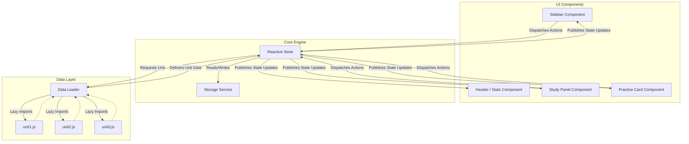

# SDD Proposal: Decoupled State & Componentized Architecture

## 1. Objective
Refactor the `ingles-web` codebase into an elegant, highly maintainable, and modern frontend application using pure Vanilla JS. The goal is to completely separate State Management, Data Loading, Business Logic, and UI rendering.

## 2. Proposed Architecture Diagram



## 3. Structural Breakdown & Directory Layout
We will establish a professional, modular project folder layout:

```
ingles-web/
├── index.html
├── package.json
└── src/
    ├── main.js                 # App Bootstrapper & orchestrator
    ├── style.css               # Main design tokens & custom components
    ├── data/
    │   ├── loader.js           # Handles dynamic imports of units
    │   └── units/
    │       ├── unit1.js        # Unit 1 static data (theory + exercises)
    │       ├── unit2.js        # Unit 2 static data
    │       └── unit3.js        # Unit 3 static data
    ├── services/
    │   └── storage.js          # LocalStorage persistence wrapper
    ├── store/
    │   └── appStore.js         # Unified reactive state store (Pub-Sub)
    └── components/
        ├── Header.js           # Handles streak & average mastery display
        ├── Sidebar.js          # Renders unit selector list and progress bars
        ├── StudyPanel.js       # Toggles between Theory and Practice layouts
        └── WelcomeScreen.js    # Renders first-time welcome card
```

## 4. Key Implementation Patterns

### Pub-Sub Reactive Store (`src/store/appStore.js`)
Rather than views mutating a global object directly and calling global rendering functions, components will dispatch **actions** to a reactive Store, which updates the state and broadcasts it to registered listeners.

### Lazy Loading of Units (`src/data/loader.js`)
Instead of bundling all units into a single chunk, Vite will load unit data files on-demand using dynamic `import()` statements, ensuring quick initial load times.

## 5. Timeline & Safety
No user-facing behavior or visual styling will change. This is a pure structural refactoring. We will perform the changes iteratively, ensuring the application remains fully functional at every step.
